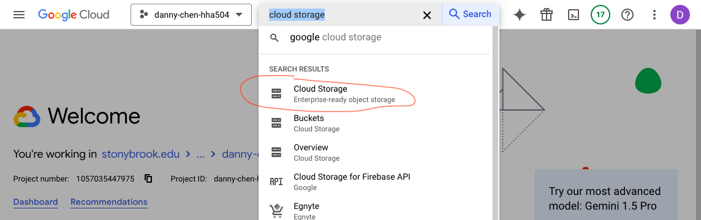

# Working with Cloud Storage in Azure and GCP

## Things To Remember
* Make sure to ignore files that contain sensitive info like keys in .gitignore

## Screenshots of file uploads in Azure and GCP
### Azure
#### Uploading with Azure's GUI
1. Click "Storage Accounts"

2. Basics tab configurations (leave default for other tabs)
    * Primary service: Azure Blob Storage or Azure Data Lake Storage Gen 2
    * Primary workload: Other
    * Redundancy: Locally-redundant storage (LRS)

3. Create the resource, then go to it after it's made

4. Click "+ Container," make a name for it, then click "Create"

5. Once it's made, click the new container
6. Click "Upload" and upload anything

    * Extra
        * Click the 3-dot symbol of the uploaded item, then click "Generate SAS"
    
        * Leave everything as default and click "Generate SAS token and URL"
    
        * Copy and paste the Blob SAS URL into another tab to view the item

#### Uploading outside of Azure's GUI with Python
7. Go back to "Storage Accounts" and click the resource made before
8. On the left panel, click "Security + networking," then "Access keys"

9. Unhide the key value, then copy it
10. Store the key value into a name into an .env file (e.g. AZURE_STORAGE_ACCESS_KEY='some_key_name')
    * NOTE: If you do this in Google Colab, name the file to something that is not .env first because the file will disappear if you do. Paste the key into the file, then rename it to .env
11. Create python code to upload files to storage
    * This repo's code is found in [azure_storage.py](https://github.com/dnce17/HHA504_assignment_storage/blob/main/azure_storage.py) (NOTE: This .py file was converted from Google Colab)
        * Make sure to substitute in your key name (like AZURE_STORAGE_ACCESS_KEY), container name, and name of the file you want to upload, as needed in the code
    * NOTE: I initially put the code in a .py file rather than Google Colab, but installing the azure-blob-storage package will require installing Rust. From what I researched, it seems that Rust can only be installed globally and not on a venv. Thus, I chose to move to Colab rather than doing a global installation.  

### GCP
#### Uploading with GCP's GUI
1. Go to "Cloud Storage - Enterprise-ready object storage." These configurations were set for the following headers:

    * Choose where to store your data
        * Location type: Region

    * Choose how to control access to objects
        * Enforce public access prevention on this bucket: Checked
2. Create the bucket, then click "Upload" to upload a file/folder

    * Extra
        * Click the 3-dot symbol of the item you uploaded, then click "Copy Authenticated URL"

        * Paste the URL into another tab to view your item

#### Uploading outside of GCP's GUI with Python
3. Go to "IAM - IAM & Admin"

4. Hover to left bar and click "Service Accounts"

5. Click "Create Service Account
6. Change role to "Editor" and leave rest alone

7. Create the account, then click "Manage keys"

8. Create new key as JSON

9. Rename file as desired, then put it into a repository
10. Ignore the file in .gitignore
11. Create and activate a venv, then install google-cloud-storage and pillow with pip
12. Create python code to upload files to storage
    * This repo's code is found in [gcp_storage.py](https://github.com/dnce17/HHA504_assignment_storage/blob/main/gcp_storage.py)
        * The comments note the things to replace with the key, bucket name, etc. 

### Explore Storage Features For Managing and Securing Data 
#### Azure
* Storage Accounts
    * In the "Security + networking" tab...
        * Networking tab
            * can configure public network access
        * Access keys tab
            * can rotate keys
        * Shared access signature tab
            * can give storage account access to clients with differing permissions
        * Encryption
        * Microsoft Defender for Cloud
    * In the "Data management" tab...
        * Data protecton tab
            * has options for recovering data when modified or deleted
        * Lifecycle management tab
            * Can create rules to move data to certain access tiers or have them expire at the end of its lifecycle
* Containers
    * change access level
    * access control (IAM)

#### GCP
* IAM
    * create deny policies
    * remove or grant access in IAM tab or in a specific service account
    * delete existing keys from service accounts
* Buckets
    * Permission tab
        * prevent public access
        * switch to fine-grained object access 
    * Protection
        * change soft delete policy
        * turn object versioning off or on
        * set a bucket or object retention policy
        * default event-based hold option 
    * Lifecycle
        * add or delete lifecycle rules