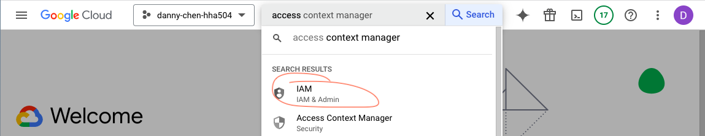
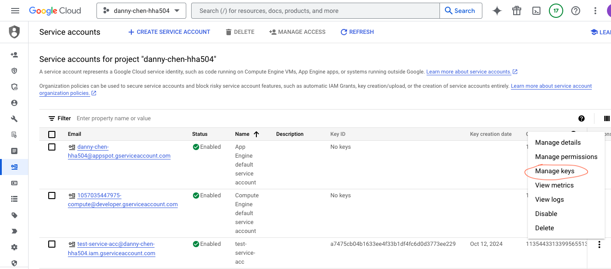

# HHA504_assignment_storage

## Instructions
* Screenshots of file uploads via GUI in Azure and GCP.
* Python code for uploading files to Azure Blob Storage and GCP Cloud Storage.
* Notes on storage management and security features in Azure and GCP.

## Things To Remember
* Make sure to ignore files that contain sensitive info like keys in .gitignore

## Screenshots of file uploads via GUI in Azure and GCP
### GCP

#### Uploading within GCP itself
1. Go to "Cloud Storage - Enterprise-ready object storage"

    * Choose where to store your data
        * Location type: Region

    * Choose how to control access to objects
        * Enforce public access prevention on this bucket: Checked
2. Create the bucket, then click "Upload" to upload a file/folder

### Uploading outside of GCP to Cloud Storage + Python code
3. Go to "IAM - IAM & Admin"

4. Hover to left bar and click "Service Accounts"

5. Click "Create Service Account
6. Changed role to "Editor;" the rest of was left alone

7. Create the account, click "Manage keys"

8. Create new key as JSON

9. Rename file as desired, then put it into a repository
10. Ignore the file in .gitignore
11. Create and activate a venv, then install google-cloud-storage and pillow with pip
12. Create python code to upload files to storage
    * This repo's code is found in [gcp_storage.py](https://github.com/dnce17/HHA504_assignment_storage/blob/main/gcp_storage.py)
        * The comments note the things to replace with your key, bucket name, etc. 
